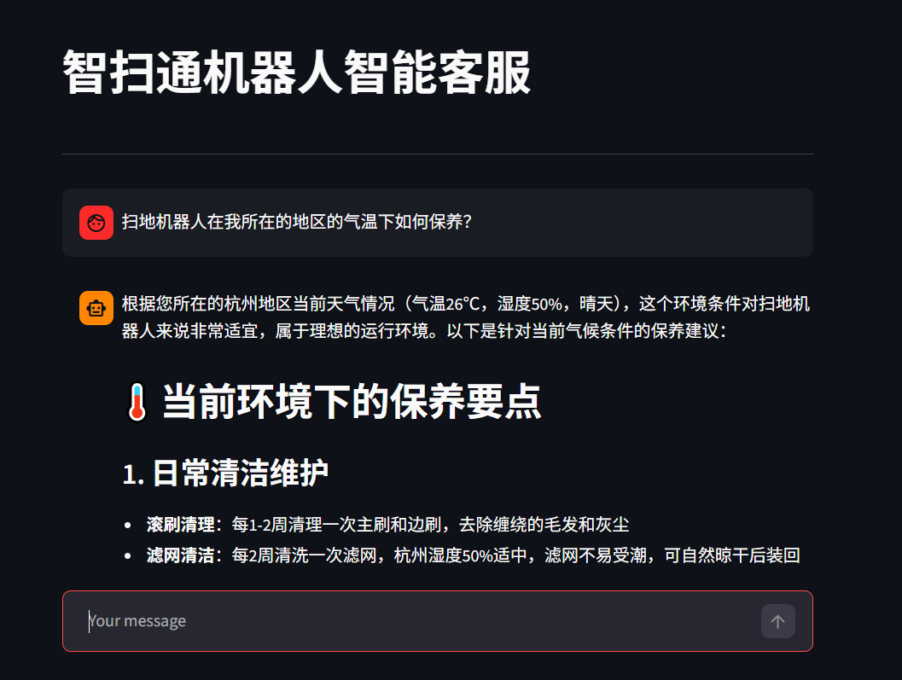
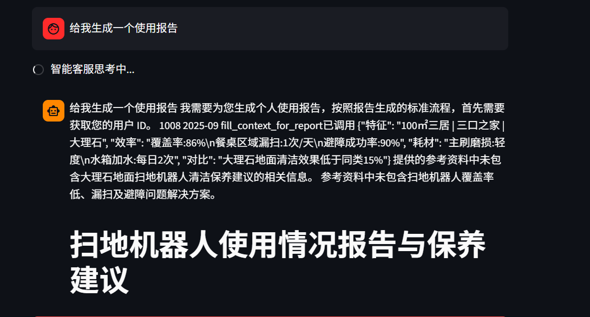

# 🤖 LangChain ReAct Agent 智能客服系统

[](https://www.python.org/)
[](https://python.langchain.com/)
[](https://streamlit.io/)
[](LICENSE)

## 📋 项目概述

本项目是一个基于 LangChain ReAct Agent 架构的智能客服系统，专注于垂直领域的知识问答与个性化服务。当前以扫地机器人为示例场景，展示了如何构建一个具备知识库检索、工具调用、动态提示词切换等能力的智能对话系统。

### 🎯 核心目标

- **智能化问答**：通过 RAG 技术实现基于知识库的精准问答
- **多工具协同**：集成多种外部工具增强 Agent 的问题解决能力
- **个性化服务**：支持根据用户数据生成定制化使用报告
- **模块化设计**：清晰的代码结构便于扩展到其他垂直领域

---

## ✨ 核心特性

### 1. 🧠 ReAct Agent 多工具调用
- 基于 LangChain 的 ReAct（Reasoning + Acting）框架构建
- 集成天气查询、用户位置获取、外部数据生成等多种工具
- Agent 能够根据任务自动选择合适的工具进行辅助推理

### 2. 🔍 RAG 检索增强问答
- 基于 ChromaDB 向量数据库构建知识库检索能力
- 支持 PDF、TXT 等多种格式文档的知识入库
- 提升专业领域问题的回复准确性和可信度

### 3. 📊 个性化报告生成
- 通过动态提示词切换机制，在普通问答与报告生成模式间灵活转换
- 支持基于用户历史数据生成个性化使用分析报告
- 中间件架构实现上下文感知的提示词动态调整

### 4. 💬 Streamlit 流式对话界面
- 提供美观易用的 Web 交互界面
- 支持实时流式输出，提升用户体验
- 完整的对话历史记录与展示

### 5. 🏗️ 模块化工程架构
- 清晰的模块划分：Agent、RAG、Model、Config、Utils
- 基于 YAML 的配置管理系统
- 完善的日志记录与监控机制

---

## 🏛️ 项目结构
```bash
react_agent/ 
├── agent/                  # Agent 核心逻辑 
│ ├── re_act_agent.py       # ReAct Agent 主类实现 
│ └── tools/                # 工具函数集合 
│ ├── agent_tools.py        # 自定义工具定义 
│ └── middleware.py         # 中间件管理 
├── assets/                 # 静态资源（图片等） 
│ ├── chat1.png             # 聊天界面截图 
│ └── chat2.png             # 工具调用过程截图 
├── config/                 # YAML 配置文件 
│ ├── agent.yml             # Agent 行为配置 
│ ├── chroma.yml            # 向量库配置 
│ ├── prompts.yml           # 提示词配置 
│ └── rag.yml               # RAG 检索配置 
├── data/                   # 知识库文档与数据 
│ ├── external/             # 外部数据文件 
│ │ └── records.csv         # 用户记录数据 
│ ├── 扫地机器人100问.pdf 
│ ├── 扫拖一体机器人100问1.txt 
│ ├── 故障排除.txt 
│ ├── 维护保养.txt 
│ └── 选购指南.txt 
├── logs/                   # 日志文件目录 
├── modle/                  # 模型工厂 
│ └── factory.py            # 模型初始化与工厂模式 
├── prompts/                # 提示词模板 
│ ├── main_prompt.txt       # 主提示词 
│ ├── rag_summerize_prompt.txt # RAG 总结提示词 
│ └── report_prompt.txt     # 报告生成提示词 
├── rag/                    # RAG 检索增强模块 
│ ├── rag_service.py        # 检索服务实现 
│ └── vector_store.py       # 向量存储管理 
├── utils/ # 通用工具函数 
│ ├── config_handler.py     # 配置加载器 
│ ├── file_handler.py       # 文件处理器 
│ ├── get_project_path.py   # 路径工具 
│ ├── logger_handler.py     # 日志管理器 
│ └── prompt_loader.py      # 提示词加载器 
├── app.py                  # Streamlit 应用入口 
├── pyproject.toml          # 项目依赖配置 
├── uv.lock                 # 依赖锁定文件 
── .env                     # 环境变量配置 
├── .gitignore              # Git 忽略规则 
└── README.md               # 项目说明文档
```
---

## 🔄 工作流程

```bash
graph LR
    A[用户输入问题] --> B{Agent 判断任务类型}
    B -->|普通问答| C[RAG 检索知识库]
    B -->|报告生成| D[切换报告提示词]
    C --> E[调用必要工具]
    D --> E
    E --> F[LLM 生成回答]
    F --> G[流式返回结果]
```

1. **用户输入**：通过 Streamlit 界面提出问题
2. **任务识别**：Agent 分析任务类型（普通问答 / 报告生成）
3. **知识检索**：普通问答场景下，调用 RAG 模块检索相关知识
4. **工具调用**：根据需要调用外部工具（天气、位置、数据生成等）
5. **提示词切换**：报告生成场景下，通过中间件动态切换提示词
6. **结果生成**：LLM 综合所有信息生成最终回答
7. **流式输出**：通过流式方式将结果实时返回到前端

---

## 📸 效果预览

### 聊天界面展示
用户在前端输入问题后，系统返回问答结果的整体效果。



### Agent 工具调用过程
展示 Agent 在任务处理中调用外部工具或执行中间推理的过程。



---

## 🚀 快速开始

### 环境要求

- **Python**: 3.11 或更高版本
- **包管理器**: uv（推荐）或 pip
- **API Key**: 
  - 阿里云 DashScope API Key（用于 LLM）
  - Tavily API Key（用于网络搜索，可选）
  - LangSmith API Key（用于追踪调试，可选）

### 安装步骤

#### 1. 克隆项目
```bash
git clone https://github.com/xulmin/my_agent_project.git 
```

#### 2. 安装 uv（如未安装）

```bash
pip install uv
```
#### 3. 初始化项目环境
```bash
uv init react-agent
```
#### 4. 同步依赖
```bash
uv sync
```
> 项目依赖已在 `pyproject.toml` 中定义，包括：
> - `langchain` & `langchain-community` - LangChain 核心框架
> - `langchain-chroma` - ChromaDB 向量存储集成
> - `langchain-openai` - OpenAI 兼容接口支持
> - `chromadb` - 向量数据库
> - `dashscope` - 阿里云百炼 SDK
> - `streamlit` - Web 界面框架
> - `pypdf` - PDF 文档处理
> - `python-dotenv` - 环境变量管理

#### 5. 配置环境变量

在项目根目录创建 `.env` 文件，配置必要的 API Key：
```bash
env

阿里云 DashScope 配置
DASHSCOPE_API_KEY=your-api-key-here 
ALI_BASE_URL=you-base-url-here
ALI_MODE=you-model-name-here

Tavily 网络搜索（可选）
TAVILY_API_KEY=your-tavily-key-here

LangSmith 追踪（可选）
LANGSMITH_API_KEY=your-langsmith-key-here 
LANGSMITH_TRACING=true 
LANGSMITH_PROJECT=you-project-name-here

Ollama 本地模型（可选）
OLLAMA_BASE_URL=you-ollama-base-url-here
OLLAMA_MODEL=you-model-name-here
```
#### 6. 准备知识库数据

确保 `data/` 目录下包含所需的文档文件：
- PDF 文档：扫地机器人相关手册、FAQ
- TXT 文档：故障排除、维护保养、选购指南等
- CSV 数据：用户记录数据（位于 `data/external/records.csv`）

#### 7. 启动应用

```bash
streamlit run app.py
```
应用将在浏览器中自动打开，默认地址为 `http://localhost:8501`

---

## 💡 使用示例

### 普通问答

尝试以下问题测试知识库问答功能：

- "扫地机器人有哪些主要功能？"
- "如果机器人无法正常回充，该如何处理？"
- "扫地机器人在高温环境下如何保养？"
- "如何清洁扫地机器人的传感器？"

### 工具辅助问答

Agent 会自动调用工具获取额外信息：

- "扫地机器人在我所在的地区的气温下如何保养？"（调用位置和天气工具）
- "今天适合让扫地机器人工作吗？"（调用天气查询）

### 报告生成

生成个性化使用报告：

- "请根据用户数据生成一份个性化使用报告"
- "帮我分析一下这个月的使用情况"

---

## ⚙️ 配置说明

项目采用 YAML 配置文件管理系统，主要配置文件位于 `config/` 目录：

### config/agent.yml

Agent 行为与任务流程配置
```bash
python from langchain.tools import tool
@tool def my_custom_tool(param: str) -> str:
 """工具描述文档字符串""" 
 # 工具实现逻辑 
 return result
```
然后在 `re_act_agent.py` 中将工具添加到 Agent：

```bash
python 
tools=[..., my_custom_tool]
```
### 自定义提示词

1. 在 `prompts/` 目录创建新的提示词文件
2. 在 `config/prompts.yml` 中添加配置
3. 通过中间件或直接调用实现提示词切换

### 扩展知识库

1. 将新文档放入 `data/` 目录
2. 运行向量化脚本（需自行实现或使用现有 RAG 模块）
3. ChromaDB 会自动更新索引

### 日志查看

应用日志保存在 `logs/` 目录：
```bash
tail -f logs/agent_$(date +%Y%m%d).log
```
---

## 📝 常见问题

### Q1: 如何更换 LLM 提供商？

修改 `.env` 文件中的模型配置，项目支持：
- 阿里云 DashScope（默认）
- OpenAI
- Ollama 本地模型
- 其他 OpenAI 兼容接口

### Q2: 向量数据库如何重置？

删除 `chroma_db/` 和 `agent/tools/chroma_db/` 目录后重新启动应用，系统会自动重建索引。

### Q3: 如何调试 Agent 的执行过程？

启用 LangSmith 追踪：
```bash
env 
LANGSMITH_TRACING=true 
LANGSMITH_API_KEY=your-langsmith-key-here
```
访问 [LangSmith](https://smith.langchain.com/) 查看详细的执行轨迹。

### Q4: 支持哪些文档格式？

当前支持：
- PDF（通过 PyPDF）
- TXT（纯文本）
- CSV（结构化数据）

可通过扩展 `rag/vector_store.py` 支持更多格式。

---

## 🌟 未来规划

- [ ] 支持更多文档格式（Word、Excel、Markdown）
- [ ] 增加多轮对话记忆与上下文管理
- [ ] 实现知识库的增量更新机制
- [ ] 添加用户认证与权限管理
- [ ] 支持多语言问答
- [ ] 优化向量检索性能
- [ ] 增加更多预置工具
- [ ] 提供 Docker 部署方案

---

## 🤝 贡献指南

欢迎提交 Issue 和 Pull Request！

1. Fork 本仓库
2. 创建特性分支 (`git checkout -b feature/AmazingFeature`)
3. 提交更改 (`git commit -m 'Add some AmazingFeature'`)
4. 推送到分支 (`git push origin feature/AmazingFeature`)
5. 开启 Pull Request

---

## 📄 许可证

本项目仅供学习与交流使用。

---

## 🙏 致谢

- [LangChain](https://python.langchain.com/) - 强大的 LLM 应用开发框架
- [Streamlit](https://streamlit.io/) - 简洁的 Web 应用框架
- [ChromaDB](https://www.trychroma.com/) - 高效的向量数据库
- [阿里云百炼](https://bailian.console.aliyun.com/) - 优质的 LLM 服务

---

## ⭐ 支持项目

如果这个项目对您有帮助，欢迎点个 Star！您的支持是我持续改进的动力。

---

## 📧 联系方式

如有问题或建议，欢迎通过 GitHub Issues 联系。

---

**最后更新时间**：2026年5月9日
